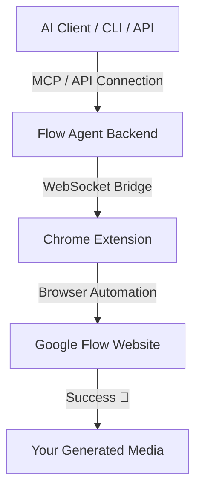

# ⚡ Flow Agent

<div align="center">

### Generate AI videos & images via HTTP/HTTPS API Server, CLI, or MCP — no API key, no limits.

**Omni Flash** for cinematic video generation · **Nano Banana 2** for unlimited image creation  
FastAPI Integration · Auto watermark removal · Reference-based editing · Zero setup.

<p align="center">
  
  
  
</p>

🎬 `T2V` `V2V` `I2V` — Video generation with auto watermark clean *(uses credits)*  
🖼️ `T2I` `I2I` — Unlimited image generation with reference support *(no credits needed)*  
🔑 Uses your Google account via Chrome extension — **no API key required**  
🔌 **MCP Server Included** — Connect directly to Claude Desktop, Cursor, Cline, Windsurf, etc.

</div>

---

## ✅ Features & Status

| Feature | What it does | Time | Status |
|---------|-------------|------|--------|
| **T2V** | Generate video from text prompt | ~44s | ✅ Working |
| **T2I** | Generate image from text prompt | ~10-30s | ✅ Working |
| **V2V** | Edit/restyle existing video | ~3min | ✅ Working |
| **I2I** | Edit image with reference | ~10-30s | ✅ Working |
| **I2V** | Animate a still image into video | ~44s | ✅ Working |
| **FL** | First + Last frame video control | ~44s | ✅ Working |
| **R2V** | Reference-based video generation | ~44s | ✅ Working |
| **Upload** | Upload video/image to Flow | ~12s | ✅ Working |
| **Watermark Remove** | Auto-remove Gemini watermark | ~1s | ✅ Auto |
| **Auto-Retry** | Auto-open/refresh Flow tab for token | auto | ✅ Built-in |
| **API Sniffer** | Discover new endpoints/payloads | - | ✅ Working |

---

## ⚡ Installation (Step by Step)

### Option A: Standalone Binaries (Easiest - No Python Setup)
1. Go to the **[Releases](https://github.com/kodelyx/flow-agent/releases/latest)** page.
2. Download the binary for your OS:
   * **Windows:** Download `flow-cli-windows.exe` and `flow-mcp-windows.exe`.
   * **macOS:** Download `flow-cli-macos` and `flow-mcp-macos`.
   * **Linux:** Download `flow-cli-linux` and `flow-mcp-linux`.
3. Put the downloaded binaries in a folder and run them directly from your terminal/command prompt!

---

### Option B: Developers (From Source with `uv`)
Make sure you have [uv](https://astral.sh/uv) installed, then run:
```bash
uv tool install git+https://github.com/kodelyx/flow-agent
```
Or set up a manual virtual environment:
```bash
git clone https://github.com/kodelyx/flow-agent.git
cd flow-agent/flow-agent
python3 -m venv .venv && source .venv/bin/activate
pip install -e .
```

---

## 🔌 Chrome Extension Setup

1. Open Chrome browser.
2. Go to `chrome://extensions` in the address bar.
3. Toggle **"Developer mode"** ON (top-right corner).
4. Click **"Load unpacked"** (top-left).
5. Select the `flow-chrome-extension/` folder from this repository.
6. Open [labs.google/fx/tools/flow](https://labs.google/fx/tools/flow) and ensure you are logged in.
7. The extension icon will show a green badge once it is connected to the backend.

---

## ⚙️ Auto-start Setup

### macOS & Linux
Inside the `flow-agent/` directory, run:
```bash
./setup.sh
```
This configures a LaunchAgent (macOS) or systemd user service (Linux) to auto-start on login. To disable: `./uninstall.sh`.

### Windows (PowerShell)
Open PowerShell in the `flow-agent/` directory and run:
```powershell
Set-ExecutionPolicy Bypass -Scope Process -Force
.\setup-windows.ps1
```
This places a startup shortcut in your user Startup folder. To disable: `.\uninstall-windows.ps1`.

---

## 🚀 CLI Usage

*If using the standalone binary, replace `flow` with your executable filename (e.g. `.\flow-cli-windows.exe`).*

### Text → Video (T2V)
```bash
# Basic (portrait 9:16, 10 seconds)
flow video "A samurai drawing his katana on a cliff at golden sunset"

# Landscape mode (16:9)
flow video "Eagle soaring over snowy mountains" --aspect landscape

# Custom output file and duration (4/6/8/10 seconds)
flow video "Dog playing in the park" -o dog.mp4 --duration 6

# I2V — animate a still image
flow video "Character comes alive" --start photo.png

# FL — First + Last frame (controlled transition)
flow video "Person walks forward" --start start.png --end end.png

# R2V — Reference images (character consistency)
flow video "Character in new scene" --ref char1.png char2.png
```

**CLI Video Options:**
| Flag | Short | Default | Description |
|------|-------|---------|-------------|
| `--output` | `-o` | `omni_output.mp4` | Output filename |
| `--aspect` | `-a` | `portrait` | `portrait` or `landscape` |
| `--duration` | `-d` | `10` | `4`, `6`, `8`, or `10` seconds |
| `--count` | `-c` | `1` | Generate 1-4 videos |
| `--edit` | `-e` | - | Pass media_id for V2V edit mode |
| `--start` | `-s` | - | Start frame image (I2V / FL mode) |
| `--end` | | - | End frame image (use with --start for FL) |
| `--ref` | `-r` | - | Reference image(s) for R2V mode |
| `--no-clean` | | - | Skip auto watermark removal |

---

### Text → Image (T2I)
```bash
# Basic (portrait 9:16)
flow image "A dragon breathing fire in a cyberpunk city"

# Landscape
flow image "Mountain sunset" --aspect landscape -o sunset.png

# Generate 4 variations
flow image "Abstract art" --count 4

# I2I: Edit with reference image
flow image "Make it anime style" --ref original.png -o anime.png
```

**CLI Image Options:**
| Flag | Short | Default | Description |
|------|-------|---------|-------------|
| `--output` | `-o` | `output/image.png` | Output filename |
| `--aspect` | `-a` | `portrait` | `portrait`, `landscape`, `square`, `4x3`, `3x4` |
| `--count` | `-c` | `1` | Generate 1-4 variations |
| `--ref` | `-r` | - | Reference image(s) for I2I |

---

### Video → Video Edit (V2V)
```bash
# Step 1: Upload your video (returns media_id)
flow upload my_video.mp4

# Step 2: Edit with style prompt
flow edit "Transform into vibrant anime style, Studio Ghibli aesthetic" \
    --media-id <uploaded_media_id> \
    --video-file my_video.mp4 \
    --output output_anime/ \
    --merge
```

---

## 🔌 Connecting to Your AI (MCP)

Flow Agent includes a built-in MCP server. Copy this configuration snippet and add it to your client (e.g. Cursor, Claude Desktop):

```json
{
  "mcpServers": {
    "flow": {
      "command": "flow-mcp",
      "args": []
    }
  }
}
```
> 💡 *Note: If using pre-built binaries, replace `"flow-mcp"` with the absolute path to your downloaded binary (e.g. `"C:\\Downloads\\flow-mcp-windows.exe"`).*

See **[MCP.md](MCP.md)** for comprehensive configuration steps.

---

## 🌐 HTTP/HTTPS API Server

Start the long-lived API server (OpenAI-compatible):
```bash
flow serve
# or expose on custom port/host
flow serve --host 0.0.0.0 --port 8000
```

### Core API Endpoints
| Method | Endpoint | Description |
|--------|----------|-------------|
| **GET** | `/health` | Check Extension Bridge health. |
| **POST** | `/v1/images/generations` | OpenAI-compatible image generations endpoint. |
| **POST** | `/v1/videos/generations` | OpenAI-compatible video generations endpoint. |
| **GET** | `/v1/credits` | Get remaining Google Flow credits. |
| **GET** | `/download/{filename}` | Download generated image/video files. |

---

## 🐍 Python API (For Developers)

You can import and use the `omniflash` package directly inside your custom Python scripts:
```python
import asyncio
from omniflash import ExtensionBridge, generate_video, poll_status, download_video, DEFAULT_PROJECT

async def main():
    bridge = ExtensionBridge()
    await bridge.start()
    await bridge.wait_for_extension(30)

    media_ids = await generate_video(bridge, "Cinematic shot of neon streets", project_id=DEFAULT_PROJECT)
    if media_ids:
        await poll_status(bridge, media_ids[0], DEFAULT_PROJECT)
        await download_video(bridge, media_ids[0], "output.mp4")

    await bridge.close()

asyncio.run(main())
```

---

## 📁 Project Structure

```
flow-mcp/
├── README.md                   # Home Page Documentation
├── MCP.md                      # Detailed MCP Client configurations
├── flow-chrome-extension/      # Chrome extension source
└── flow-agent/                 # CLI & Python Backend
    ├── cli/                    # CLI modules (generate, image, upload, edit, etc.)
    ├── flow_cli/               # flow command line wrapper entrypoint
    ├── flow_mcp_server.py      # MCP Server entrypoint
    ├── omniflash/              # Core Python library modules
    ├── config.env              # Environment config file
    ├── setup.sh                # macOS/Linux autostart installer
    ├── uninstall.sh            # macOS/Linux autostart uninstaller
    ├── setup-windows.ps1       # Windows autostart installer
    └── uninstall-windows.ps1   # Windows autostart uninstaller
```

---

## 🚀 How It Works


