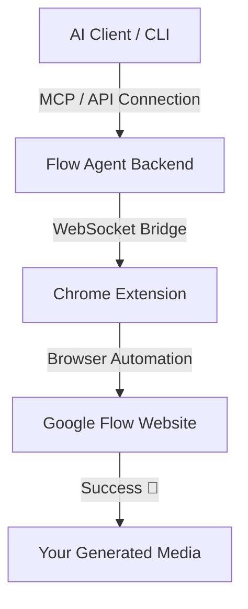

# ⚡ Flow Agent

<p align="center">
  
  
  
</p>

---

**Flow Agent** is a programmable, **OpenAI-compatible API + CLI** built on top of **Google Flow (Google Labs)**. It also includes an **MCP server** allowing Claude, Cursor, and other AI clients to generate high-quality images & video directly from your chat!

It works by establishing a secure WebSocket bridge to the **Flow Chrome Extension**, executing commands inside a logged-in Google Flow browser session.

> 📢 **No API Keys or Python setup required!** Just download the binary, open Chrome with the extension, and let your AI agent generate media.

---

## ✨ Features

* 🎥 **Video Generation:** Text-to-video capabilities powered by Google Flow.
* 🖼️ **Image Generation:** High-resolution image generation (up to 4 per prompt).
* 🔌 **MCP Server:** Native support for Claude Desktop, Cursor, Cline, Windsurf, and Antigravity.
* 🌐 **OpenAI Compatible:** Drop-in replacement for OpenAI image/video endpoints (`/v1/images/generations` & `/v1/videos/generations`).
* 📦 **Zero Dependencies:** Standalone pre-built binaries for all major platforms.
* 💳 **Credits Checker:** Monitor your Google Flow credits directly from the CLI or AI client.

---

## 🚀 How It Works



---

## ⚡ Quick Install (No Python Required)

The absolute easiest way to get started is to download our pre-built standalone binaries:

1. Head over to the **[GitHub Releases](https://github.com/kodelyx/flow-agent/releases/latest)** page.
2. Download the binaries for your Operating System:
   * **Windows:** `flow-cli-windows.exe` & `flow-mcp-windows.exe`
   * **macOS:** `flow-cli-macos` & `flow-mcp-macos`
   * **Linux:** `flow-cli-linux` & `flow-mcp-linux`
3. Launch your terminal/prompt in the download folder and run the CLI directly!

*(Optional: Download [config.env](config.env) and place it next to the executable to customize settings like project ID).*

---

## ⚙️ Auto-start Setup

Keep the Flow Agent running in the background automatically:

### macOS & Linux
Inside the directory, run:
```bash
./setup.sh
```
This configures a LaunchAgent (macOS) or systemd user service (Linux) to auto-start on login. To disable, run `./uninstall.sh`.

### Windows (PowerShell)
Open PowerShell in the directory and run:
```powershell
Set-ExecutionPolicy Bypass -Scope Process -Force
.\setup-windows.ps1
```
This places a startup shortcut in your Windows Startup folder. To disable, run `.\uninstall-windows.ps1`.

---

## 🔌 Connecting to Your AI (MCP)

Flow Agent exposes an MCP server for immediate integration. Simply add this configuration to your client (e.g., Cursor, Claude Desktop, Windsurf):

```json
{
  "mcpServers": {
    "flow": {
      "command": "flow-mcp",
      "args": []
    }
  }
}
```
> 💡 *Note: If using pre-built binaries, replace `"flow-mcp"` with the absolute path to your downloaded binary (e.g. `"C:\\Downloads\\flow-mcp-windows.exe"`).*

See **[MCP.md](MCP.md)** for detailed, client-specific configurations.

---

## 🛠️ Developers (From Source)

If you prefer building from source or extending the project:

### Using `uv` (Fastest)
```bash
uv tool install git+https://github.com/kodelyx/flow-agent
```

### Manual Virtual Environment
```bash
python3 -m venv .venv && source .venv/bin/activate
pip install -e .
```

---

## 🌐 API Reference

With `flow serve` running, the backend exposes OpenAI-compliant endpoints at `http://localhost:8001`:

* `POST /v1/images/generations` - Generate images
* `POST /v1/videos/generations` - Generate videos
* `GET  /v1/credits` - Check remaining Google Flow credits
* `GET  /health` - Check backend and extension connection health
