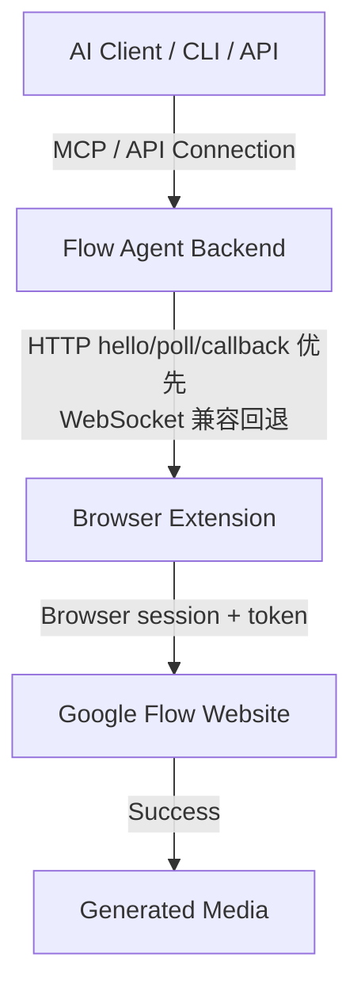

# ⚡ Flow Agent

<div align="center">

### Generate AI videos & images via HTTP/HTTPS API Server, CLI, or MCP — no API key, no limits.

**Omni Flash** for cinematic video generation · **Nano Banana 2** for unlimited image creation  
FastAPI Integration · Auto watermark removal · Reference-based editing · Zero setup.

<p align="center">
  
  
  
</p>

🎬 `T2V` `V2V` `I2V` — Video generation with auto watermark clean *(uses credits)*  
🖼️ `T2I` `I2I` — Unlimited image generation with reference support *(no credits needed)*  
🔑 Uses your Google account via Chrome extension — **no API key required**  
🔌 **MCP Server Included** — Connect directly to Claude Desktop, Cursor, Cline, Windsurf, etc.

</div>

---

## 🧭 本仓库工作区说明（迁移后）

> **从本会话起，所有开发与改造都在本目录进行。**

| 项 | 值 |
|----|----|
| **工作目录** | `F:\Code\Flow-Agent-New` |
| **后端源码** | `F:\Code\Flow-Agent-New\flow-agent` |
| **浏览器插件** | `F:\Code\Flow-Agent-New\flow-chrome-extension` |
| **改造计划** | [`docs/superpowers/plans/2026-07-20-extension-http-bridge.md`](docs/superpowers/plans/2026-07-20-extension-http-bridge.md) |

### 为什么迁移
旧路径（Hubstudio 安装目录 / Flow-Agent-Cloak worktree）混杂运行时文件与多份副本，不利于干净开发。  
本目录为独立干净仓库副本，后续请只在这里改代码、跑测试、提交。

### 新会话接手请先做
```powershell
cd F:\Code\Flow-Agent-New
dir
Test-Path .\flow-agent\omniflash\bridge.py
Test-Path .\flow-chrome-extension\background.js
Get-Content .\docs\superpowers\plans\2026-07-20-extension-http-bridge.md -TotalCount 40
```

### 当前进行中的改造
**目标：** 指纹浏览器（Hubstudio / AdsPower）里插件连不上本地 WebSocket 的问题。  
**方案：** 扩展与后端改为 **HTTP 优先**（`hello` + `poll` + `callback`），WebSocket 仅作兼容回退。

| 状态 | 说明 |
|------|------|
| ✅ 已完成 | 工作区迁移；`ExtensionHttpRegistry`；`POST /api/ext/hello` + `GET /api/ext/poll`；`/health.transport`；扩展 HTTP 优先 transport |
| ✅ 配置 | `EXT_TRANSPORT` / `EXT_SESSION_TTL_SEC` / `EXT_POLL_INTERVAL_MS` / `ENABLE_EXTENSION_WS`（见 `flow-agent/config.env`） |
| 🔜 验证 | 官方 Chrome / Hubstudio / AdsPower 实测连通 |
| ⚠ 边界 | 若指纹浏览器连本地 HTTP 也全拦，还需 LAN IP / 公网隧道（不在当前计划内） |

验证成功时 `/health` 期望类似：
```json
{
  "extension_connected": true,
  "has_flow_key": true,
  "transport": "http"
}
```

### 本地快速启动（本目录）

> **重要：** 不要用全局 `flow serve` / 其他目录安装的 `flow.exe`。  
> 本机 PATH 上的 `flow` 可能是旧代码（例如 hermes venv），会占住 `:8001` 导致测到旧后端。

```powershell
# 推荐：工作区脚本（会先停掉占用 8001 的旧后端，再启动本仓库代码）
cd F:\Code\Flow-Agent-New
.\scripts\dev-serve.ps1

# 确认当前 8001 跑的是本仓库
.\scripts\which-backend.ps1

# 健康检查（应含 code_root = 本仓库 flow-agent 路径，且有 transport）
curl http://127.0.0.1:8001/health

# 浏览器：chrome://extensions → 加载已解压扩展
# 选择：F:\Code\Flow-Agent-New\flow-chrome-extension
# 然后打开 https://labs.google/fx/tools/flow
```

等价手写启动（仅当确认未跑旧 flow.exe 时）：

```powershell
cd F:\Code\Flow-Agent-New\flow-agent
$env:PYTHONPATH = (Get-Location).Path
python -m flow_cli serve --host 127.0.0.1 --port 8001
```


## 🔌 指纹浏览器 / HTTP 桥

在 **Hubstudio / AdsPower** 等指纹浏览器里，本地 **WebSocket 经常被拦或秒断**，但本地 **HTTP 通常可用**。

本仓库默认使用 **HTTP 优先** 桥接：

| 方向 | 接口 | 说明 |
|------|------|------|
| 扩展 → 后端 | `POST /api/ext/hello` | 注册 session、上报 `flowKey`、领取 secret |
| 扩展 → 后端 | `GET /api/ext/poll` | 拉取待执行命令（Bearer secret） |
| 扩展 → 后端 | `POST /api/ext/callback` | 回传结果 / token / ready（Bearer secret） |
| 后端 → 扩展 | 命令队列 | `send_message` 在 HTTP 模式下入队，由 poll 取走 |
| 兼容 | `WS /ws` | `EXT_TRANSPORT=ws` 或 auto 失败时回退 |

### 健康状态

```bash
curl http://127.0.0.1:8001/health
```

期望（HTTP 模式连通）：

```json
{
  "status": "healthy",
  "extension_connected": true,
  "has_flow_key": true,
  "transport": "http"
}
```

> **连接定义：** 最近一次 hello/poll 在 TTL 内（默认 20s）且持有 flowKey，**不再**要求 WebSocket 对象存在。

### 相关配置（`flow-agent/config.env`）

```env
EXT_TRANSPORT=auto
EXT_SESSION_TTL_SEC=20
EXT_POLL_INTERVAL_MS=1000
ENABLE_EXTENSION_WS=1
```

### 加载扩展

Chrome / 指纹浏览器扩展管理页 → 加载已解压扩展 → 选择：

`F:\Code\Flow-Agent-New\flow-chrome-extension`

然后打开 `https://labs.google/fx/tools/flow` 登录 Google，等待 token 捕获。

---

## ✅ Features & Status

| Feature | What it does | Time | Status |
|---------|-------------|------|--------|
| **T2V** | Generate video from text prompt | ~44s | ✅ Working |
| **T2I** | Generate image from text prompt | ~10-30s | ✅ Working |
| **V2V** | Edit/restyle existing video | ~3min | ✅ Working |
| **I2I** | Edit image with reference | ~10-30s | ✅ Working |
| **I2V** | Animate a still image into video | ~44s | ✅ Working |
| **FL** | First + Last frame video control | ~44s | ✅ Working |
| **R2V** | Reference-based video generation | ~44s | ✅ Working |
| **Upload** | Upload video/image to Flow | ~12s | ✅ Working |
| **Watermark Remove** | Auto-remove Gemini watermark | ~1s | ✅ Auto |
| **Auto-Retry** | Auto-open/refresh Flow tab for token | auto | ✅ Built-in |
| **API Sniffer** | Discover new endpoints/payloads | - | ✅ Working |

---

## ⚡ Installation (Step by Step)

### Option A: Standalone Binaries (Easiest - No Python Setup)
1. Go to the **[Releases](https://github.com/kodelyx/flow-agent/releases/latest)** page.
2. Download the binary for your OS:
   * **Windows:** Download `flow-cli-windows.exe` and `flow-mcp-windows.exe`.
   * **macOS:** Download `flow-cli-macos` and `flow-mcp-macos`.
   * **Linux:** Download `flow-cli-linux` and `flow-mcp-linux`.
3. Put the downloaded binaries in a folder and run them directly from your terminal/command prompt!

---

### Option B: Developers (From Source with `uv`)
Make sure you have [uv](https://astral.sh/uv) installed, then run:
```bash
uv tool install git+https://github.com/kodelyx/flow-agent
```
Or set up a manual virtual environment:
```bash
git clone https://github.com/kodelyx/flow-agent.git
cd flow-agent/flow-agent
python3 -m venv .venv && source .venv/bin/activate
pip install -e .
```

---

## 🔌 Chrome Extension Setup

1. Open Chrome browser.
2. Go to `chrome://extensions` in the address bar.
3. Toggle **"Developer mode"** ON (top-right corner).
4. Click **"Load unpacked"** (top-left).
5. Select the `flow-chrome-extension/` folder from this repository（本机完整路径：`F:\Code\Flow-Agent-New\flow-chrome-extension`）。
6. Open [labs.google/fx/tools/flow](https://labs.google/fx/tools/flow) and ensure you are logged in.
7. The extension icon will show a green badge once it is connected to the backend.

---

## ⚙️ Auto-start Setup

### macOS & Linux
Inside the `flow-agent/` directory, run:
```bash
./setup.sh
```
This configures a LaunchAgent (macOS) or systemd user service (Linux) to auto-start on login. To disable: `./uninstall.sh`.

### Windows (PowerShell)
Open PowerShell in the `flow-agent/` directory and run:
```powershell
Set-ExecutionPolicy Bypass -Scope Process -Force
.\setup-windows.ps1
```
This places a startup shortcut in your user Startup folder. To disable: `.\uninstall-windows.ps1`.

---

## 🚀 CLI Usage

*If using the standalone binary, replace `flow` with your executable filename (e.g. `.\flow-cli-windows.exe`).*

### Text → Video (T2V)
```bash
# Basic (portrait 9:16, 10 seconds)
flow video "A samurai drawing his katana on a cliff at golden sunset"

# Landscape mode (16:9)
flow video "Eagle soaring over snowy mountains" --aspect landscape

# Custom output file and duration (4/6/8/10 seconds)
flow video "Dog playing in the park" -o dog.mp4 --duration 6

# I2V — animate a still image
flow video "Character comes alive" --start photo.png

# FL — First + Last frame (controlled transition)
flow video "Person walks forward" --start start.png --end end.png

# R2V — Reference images (character consistency)
flow video "Character in new scene" --ref char1.png char2.png
```

**CLI Video Options:**
| Flag | Short | Default | Description |
|------|-------|---------|-------------|
| `--output` | `-o` | `omni_output.mp4` | Output filename |
| `--aspect` | `-a` | `portrait` | `portrait` or `landscape` |
| `--duration` | `-d` | `10` | `4`, `6`, `8`, or `10` seconds |
| `--count` | `-c` | `1` | Generate 1-4 videos |
| `--edit` | `-e` | - | Pass media_id for V2V edit mode |
| `--start` | `-s` | - | Start frame image (I2V / FL mode) |
| `--end` | | - | End frame image (use with --start for FL) |
| `--ref` | `-r` | - | Reference image(s) for R2V mode |
| `--no-clean` | | - | Skip auto watermark removal |

---

### Text → Image (T2I)
```bash
# Basic (portrait 9:16)
flow image "A dragon breathing fire in a cyberpunk city"

# Landscape
flow image "Mountain sunset" --aspect landscape -o sunset.png

# Generate 4 variations
flow image "Abstract art" --count 4

# I2I: Edit with reference image
flow image "Make it anime style" --ref original.png -o anime.png
```

**CLI Image Options:**
| Flag | Short | Default | Description |
|------|-------|---------|-------------|
| `--output` | `-o` | `output/image.png` | Output filename |
| `--aspect` | `-a` | `portrait` | `portrait`, `landscape`, `square`, `4x3`, `3x4` |
| `--count` | `-c` | `1` | Generate 1-4 variations |
| `--ref` | `-r` | - | Reference image(s) for I2I |

---

### Video → Video Edit (V2V)
```bash
# Step 1: Upload your video (returns media_id)
flow upload my_video.mp4

# Step 2: Edit with style prompt
flow edit "Transform into vibrant anime style, Studio Ghibli aesthetic" \
    --media-id <uploaded_media_id> \
    --video-file my_video.mp4 \
    --output output_anime/ \
    --merge
```

---

## 🔌 Connecting to Your AI (MCP)

Flow Agent includes a built-in MCP server. Copy this configuration snippet and add it to your client (e.g. Cursor, Claude Desktop):

```json
{
  "mcpServers": {
    "flow": {
      "command": "flow-mcp",
      "args": []
    }
  }
}
```
> 💡 *Note: If using pre-built binaries, replace `"flow-mcp"` with the absolute path to your downloaded binary (e.g. `"C:\\Downloads\\flow-mcp-windows.exe"`).*

See **[MCP.md](MCP.md)** for comprehensive configuration steps.

---

## 🌐 HTTP/HTTPS API Server

Start the long-lived API server (OpenAI-compatible):
```bash
flow serve
# or expose on custom port/host
flow serve --host 0.0.0.0 --port 8000
```

### Core API Endpoints
| Method | Endpoint | Description |
|--------|----------|-------------|
| **GET** | `/health` | Check Extension Bridge health. |
| **POST** | `/v1/images/generations` | OpenAI-compatible image generations endpoint. |
| **POST** | `/v1/videos/generations` | OpenAI-compatible video generations endpoint. |
| **GET** | `/v1/credits` | Get remaining Google Flow credits. |
| **GET** | `/download/{filename}` | Download generated image/video files. |

---

## 🐍 Python API (For Developers)

You can import and use the `omniflash` package directly inside your custom Python scripts:
```python
import asyncio
from omniflash import ExtensionBridge, generate_video, poll_status, download_video, DEFAULT_PROJECT

async def main():
    bridge = ExtensionBridge()
    await bridge.start()
    await bridge.wait_for_extension(30)

    media_ids = await generate_video(bridge, "Cinematic shot of neon streets", project_id=DEFAULT_PROJECT)
    if media_ids:
        await poll_status(bridge, media_ids[0], DEFAULT_PROJECT)
        await download_video(bridge, media_ids[0], "output.mp4")

    await bridge.close()

asyncio.run(main())
```

---

## 📁 Project Structure

```
F:\Code\Flow-Agent-New\
├── README.md                   # 本说明（含工作区迁移与改造入口）
├── MCP.md                      # MCP Client configurations
├── docs/
│   └── superpowers/plans/      # 实现计划（HTTP 桥改造等）
├── flow-chrome-extension/      # Chrome / 指纹浏览器插件源码
├── flow-agent/                 # CLI & Python 后端
│   ├── cli/                    # API / CLI modules
│   ├── flow_cli/               # `flow` 命令入口
│   ├── flow_mcp_server.py      # MCP Server
│   ├── omniflash/              # 核心库（bridge、生成器等）
│   ├── tests/                  # 后端测试
│   ├── config.env              # 环境配置
│   ├── setup-windows.ps1       # Windows 自启动
│   └── ...
└── release/                    # 预编译二进制（可选）
```

---

## 🚀 How It Works



> 当前线上/源码默认仍以 WebSocket 为主；**进行中的改造**会把扩展桥切换为 HTTP 优先，计划见  
> [`docs/superpowers/plans/2026-07-20-extension-http-bridge.md`](docs/superpowers/plans/2026-07-20-extension-http-bridge.md)。


