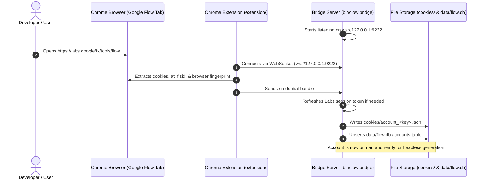

# Chrome Extension Bridge Architecture

How the **Flow Chrome Extension** captures credentials and bridges authenticated Google sessions into **Flow Agent**.

---

## 1. Why the Extension Bridge Exists

Google Flow employs enterprise-grade anti-automation defenses:
- **Cookie Jar Requirements**: Requires authenticated session cookies (`__Secure-ENID`, `SID`, `HSID`, `SSID`, `APISID`, `SAPISID`, `OTZ`).
- **Dynamic Batchexecute Page Tokens**: Requires `at` (anti-CSRF token) and `f.sid` (session session id) extracted from the active DOM.
- **Hardware Fingerprint Matching**: Generation requests are signed with client parameters (screen resolution, WebGL canvas, user-agent) that must match the reCAPTCHA token assessment.

Rather than running heavy, detectable headless browsers on every generation call, Flow Agent uses an **out-of-band capture architecture**:
1. You sign in once to Google Flow in your real browser (Chrome / Chromium).
2. The lightweight browser extension synchronizes session credentials to your local machine.
3. The Go engine binary saves these into `cookies/account_<hash>.json`.
4. Subsequent generations run completely headless, at native API speed (sub-second submission).

---

## 2. Architecture & Data Flow



---

## 3. Extension Installation

1. In Google Chrome, navigate to `chrome://extensions`.
2. Toggle on **Developer mode** (top right corner).
3. Click **Load unpacked** (top left).
4. Select the directory:
   ```text
   /Users/akashyadav/Akash/Flow-Agent-Work/extension
   ```
5. Pin the **Flow Extension** icon in your toolbar.

---

## 4. Starting the Bridge

Inside `flow-agent`, run:

```bash
./bin/flow bridge
```

You will see:
```text
flow-go 0.1.0
  extension      ws://127.0.0.1:9222  (load extension/ in Chrome)
  cookies        /Users/akashyadav/Akash/Flow-Agent-Work/flow-agent/cookies
  database       /Users/akashyadav/Akash/Flow-Agent-Work/flow-agent/data/flow.db
  output         /Users/akashyadav/Akash/Flow-Agent-Work/flow-agent/output

Listening for the Flow Bridge extension. Bundles are written to
cookies/account_<key>.json as each profile connects...
```

Once loaded, navigate to [Google Flow](https://labs.google/fx/tools/flow). The bridge will immediately log:
```text
bridge: extension connected
bridge: synced 16 cookies to cookies/account_<hash>.json
engine: registered account acct-e50d5ecec52e (project <id>)
```

---

## 5. Multi-Account Pooling

To attach multiple accounts:
1. Open a **different Chrome Profile** (e.g., Profile 2 / Work Profile).
2. Install the extension in that profile.
3. Sign in to a second Google Account on Google Flow.
4. The bridge automatically detects the new profile and generates a second credential file:
   - `cookies/account_c13eea595e47.json` (Account 1: 1049 credits)
   - `cookies/account_fe5e45eeb889.json` (Account 2: 50 credits)
5. `flow-agent` automatically distributes workloads across both accounts.

---

## 6. Verifying Stored Credentials

You can inspect the status and validity of all stored cookies without making any network requests:

```bash
./bin/flow cookies
```

Output:
```text
cookie file         cookies/account_c13eea595e47.json
cookies             16
has credentials     yes
earliest expiry     2027-09-24T15:48:31+05:30
```
